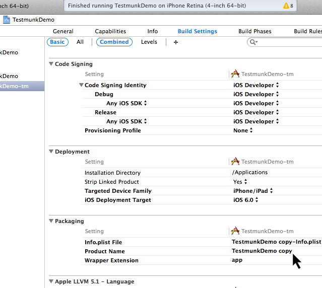

iOS
===

Testmunk iOS enables you to write automated functional testcases that you can run on various iOS devices with different OS versions. Our goal is that you are able to reduce your manual testing time tremendeously. Following the installation you will be able to write testcases and let them run locally on your simulator and iOS device as well as on a variety of iOS devices over the cloud in the testmunk device lab.

Installation
------------

This section will guide you on how to prepare your environment and Xcode project for running Calabash tests on iOS apps locally, and deploy them to testmunk for testing on multiple devices. For this tutorial, we recommend you use `our sample app project <https://github.com/testmunk/TMSample/>`_ (just clone the repository or download the ZIP file).

.. HINT::
	Calabash is a framework that allows you to write automated mobile application tests for iOS and Android. It provides APIs for mimicking input to the devices, and reading its output.

	What is calabash?

Prerequisites
~~~~~~~~~~~~~

You must be using a machine with Mac OS X. This machine must also have Xcode with its command line tools, and Ruby installed.

.. HINT::
	Download Xcode from `here <https://itunes.apple.com/us/app/xcode/id497799835>`_. Once you have Xcode installed, run this command in Terminal to install the command-line tools:

	.. code-block:: console

		$ xcode-select --install

	How do I install Xcode and its command line tools?

.. HINT::
	Your machine must have at least version 1.8.7 for Ruby to ensure compatibility for the gems we will install in the next section. By default, your Mac OS X 10.8 installation comes with Ruby 1.8.7 installed. You can check your version by running ``ruby -v`` in Terminal. If you still need to upgrade, you can try the following steps:

	1. Start Terminal. This can be found in the Applications folder -> Utilities folder.
	2. Check if you have RVM. This can be done by typing ``rvm`` into the Terminal and pressing Enter.
	3. If you do not have RVM, install RVM using the following command in Terminal: ``curl -L get.rvm.io | bash -s``
	4. If you have RVM, install a newer version of Ruby using the following command: ``rvm install 1.9.3``.
	5. Once Ruby is installed, you can verify the update using ``ruby -v`` in Terminal.

	How do I install Ruby?

Install Calabash gem
~~~~~~~~~~~~~~~~~~~~

In order to get started with testmunk, you need to install the calabash gem. Simply open your terminal window and execute:

.. code-block:: console

	$ gem install calabash-cucumber

In case you don't have the right permissions, please execute:

.. code-block:: console

	$ sudo gem install calabash-cucumber

.. DANGER:: 

	If you get an error that reads ``...can't find header files for ruby at /System/...``, that means you do not have the Xcode command-line tools correctly installed. Make sure you have Xcode installed (or download it `here <https://itunes.apple.com/us/app/xcode/id497799835>`_) and then run this command in Terminal:

	.. code-block:: console

		$ xcode-select --install

	Header files can't be found

.. DANGER:: 
	If you are getting an error that says "clang: error: unknown argument: '-multiply_definedsuppress'", you must run these 2 commands instead:

	.. code-block:: console

		$ sudo -i

		$ ARCHFLAGS=-Wno-error=unused-command-line-argument-hard-error-in-future gem install calabash-cucumber

	This error is due to deprecated arguments for the ``clang`` executable that ``gem`` calls when installing certain extensions.

	'clang error'

Installing framework in Xcode project
~~~~~~~~~~~~~~~~~~~~~~~~~~~~~~~~~~~~~

Creating a new build target
***************************

1. Open the testmunk sample project in Xcode.
2. Select your project (from the File Navigator).
3. Right click your target in the list of targets. If you do not see the list of targets, you need to press this button:

4. From the dropdown menu, select "Duplicate".

5. Rename the new target from "TestmunkDemo copy" to "TestmunkDemo-tm" by clicking on it and pressing Enter.
6. Click in the toolbar where it says TestmunkDemo, and from the dropdown menu, select "Manage Schemes".

7. Rename the new scheme from "TestmunkDemo copy" to "TestmunkDemo-tm" by clicking on it and pressing Enter. Then press OK.
8. Click on "Build Settings" and under `Packaging` set the "Product Name" to "TestmunkDemo-tm"

.. HINT::
	You want to build your app with the Calabash framework only if you are building your app for testing purposes. That is why we are setting up a target specifically for running tests.

	Why are we creating a new build target?

Link the Calabash framework
***************************

1. Open terminal and run ``calabash-ios download`` to download the latest ``calabash.framework`` file.
2. Run the command ``open .`` in Terminal.
3. Drag ``calabash.framework`` from its current location to the project's Frameworks folder in Xcode.

4. In the pop up window that appears, select `Copy items into destination group's folder (if needed)` and make sure "TestmunkDemo-tm" is the only selected target.
5. Select the "TestmunkDemo-tm" target, go to "Build Phases", and in the "Link Binary With Libraries" section, make sure that ``calabash.framework`` is present. Link the CFNetwork framework so that Calabash can communicate with your app, by clicking '+', and selecting ``CFNetwork.framework``.

Configure the build target
**************************

1. Select "Build Settings"
2. Change the filter from "Basic" to "All"
3. Make sure that "Other Linker Flags" contains: ``-force_load "$(SRCROOT)/calabash.framework/calabash" -lstdc++``

Test the configuration
**********************

Build and run your application on the simulator. You should be getting console output similar to this::

	2014-05-30 16:08:07.882 TestmunkDemo-tm[3088:60b] Creating the server: <LPHTTPServer: 0xa0970d0>
	2014-05-30 16:08:07.883 TestmunkDemo-tm[3088:60b] Calabash iOS server version: CALABASH VERSION: 0.9.169
	2014-05-30 16:08:07.889 TestmunkDemo-tm[3088:60b] Started LPHTTP server on port 37265
	2014-05-30 16:08:08.810 TestmunkDemo-tm[3088:1903] Bonjour Service Published: domain(local.) type(_http._tcp.) name(Calabash Server)

Preparing testcases
-------------------

After your Xcode project has been set up, and you have ran your app on the simulator for the first time, you are ready to make and run your own testcases.

Inspect app for elements
~~~~~~~~~~~~~~~~~~~~~~~~

Accessibility Inspector
***********************

To be able to test, you need to have a way to reference different elements in your application. iOS devices have been setting new, improved usability standards for impaired users, since Accessibility functions help them navigate through the app. These Accessibility functions come in very handy for test automation. Test cases become more robust and easier to maintain. You can enable the Accessibility Inspector by starting the Simulator, then going ``Settings -> General`` and setting Accessibility Inspector to ON.

Once the Accessibility Inspector is enabled, you can switch between two modes, inspection and navigation. If the Accessibility Inspector is minimized, then the app is in navigation mode. This means that you can tap on buttons to perform actions.

However, once you click on the X button, the window enlarges – then you are in inspection mode. Now clicking on the button will show its accessibility details.

To go back to the navigation mode, simply click the X again to minimize the Accessibility Inspector.

Calabash console
****************

A more advanced way of inspecting elements on the view is using the Calabash console to see a list of the app's visible elements. Inside the folder you downloaded, go to ``TMSample/`` and run this Terminal command:

.. code-block:: console

	$ calabash-ios console
	> start_test_server_in_background

This will start our test application in the iOS simulator. then enter:

.. code-block:: console
 
	> query("*")

You should see a list of all visible elements.

.. code-block :: ruby

	[
	    [ 0] {
	              "class" => "UIWindow",
	                 "id" => nil,
	               "rect" => {
	            "center_x" => 160,
	                   "y" => 0,
	               "width" => 320,
	                   "x" => 0,
	            "center_y" => 284,
	              "height" => 568
	        },
	              "frame" => {
	                 "y" => 0,
	             "width" => 320,
	                 "x" => 0,
	            "height" => 568
	        },
	              "label" => nil,
	        "description" => "<UIWindow: 0xb26fc60; frame = (0 0; 320 568); gestureRecognizers = <NSArray: 0xb2723a0>; layer = <UIWindowLayer: 0xb271d50>>"
	    },
	    [ 1] {
	              "class" => "UIView",
	                 "id" => nil,
	               "rect" => {
	            "center_x" => 160,
	                   "y" => 0,
	               "width" => 320,
	                   "x" => 0,
	            "center_y" => 284,
	              "height" => 568
	        },
	              "frame" => {
	                 "y" => 0,
	             "width" => 320,
	                 "x" => 0,
	            "height" => 568
	        },
	              "label" => nil,
	        "description" => "<UIView: 0x9eb3610; frame = (0 0; 320 568); autoresize = RM+BM; layer = <CALayer: 0x9eb37e0>>"
	    },
	    ...

	]

Writing testcases
~~~~~~~~~~~~~~~~~

We have installed a feature folder in your project folder. Inside the folder you downloaded, go to ``TMSample/features/``, and open the ``myfirst.feature`` file to write your testcases. You can ignore the folders step_definitions and support at this point.

The my_first.feature file is structured in the following way:

.. code-block:: cucumber

	# Scenario name
	Scenario: Login
	  Given I am on the Welcome Screen # Teststeps
	  Then I touch the "Email" input field
	  Then I use the keyboard and type "test@testname.com"
	  Then I touch the "Password" input field
	  Then I use the keyboard and type "testmunk"
	  Then I touch "SIGN IN"
	  Then I wait
	  Then I should see "Hello world"

.. HINT::
	For writing testcases, we recommend using `Sublime Text 2 <http://www.sublimetext.com/>`_ with the `Cucumber syntax highlighting plugin <http://makandracards.com/ninjaconcept/9233-how-to-use-cucumber-together-with-sublime-text-2-editor>`_.

	Text editor suggestion

You can write as many testcases as you want in your ``myfirst.feature`` file. Don’t delete the feature title line, since it is needed for a successful execution of your testcase.

Good to know: Ensure that each testcase starts from the beginning. We call it testcase independency. When you run your app on our devices, we clear the app data before each testcase. So, if your app always starts with the login process, you will need to have teststeps that cover the login process at the beginning of each testcase. Testcase independency makes your testcases more robust, and it means every testcase can be tested independently.

Our teststep library can come in handy as a reference as you’re writing your testcases.

If you run your app over our device lab, we automatically take screenshots after each teststep – you don’t need to worry about it at all.

.. VIDEO HEREEEEEE on how to use the console

Calabash Ruby API
-----------------

Calabash offers a Ruby API that we support for defining special teststeps.

A new teststep is defined in the following way:

.. code-block:: ruby
	
	# Define a regular expression to catch the step
	Then(/^"(.*?)" radio button should be selected$/) do |arg1|
	  # Use calls to the Calabash API to get information
	  if(!query("RadioButton text:'#{arg1}'", :checked).first())
	    # Act on that information
	    fail("The radio button with text #{arg1} should be selected")
	  end
	end

A teststep is considered succesful if the execution of its codeblock runs with neither explicit fails nor uncaught errors.

A nice way to try the different commands on this API is to run the Calabash console and test them.

Useful methods
~~~~~~~~~~~~~~

This are some useful functions that the Calabash API provides. You can see more about them on the `Calabash GitHub documentation <https://github.com/calabash/calabash-ios/wiki/03.5-Calabash-iOS-Ruby-API>`_.

query(uiquery, \*args)
**********************

Query returns an array with the views on the screen that match it. 

.. code-block:: ruby

	> query("UIButton")

	[
	    [0] {
	              "class" => "FUIButton",
	                 "id" => nil,
	               "rect" => {
	            "center_x" => 160,
	                   "y" => 194,
	               "width" => 300,
	                   "x" => 10,
	            "center_y" => 216,
	              "height" => 44
	        },
	              "frame" => {
	                 "y" => 194,
	             "width" => 300,
	                 "x" => 10,
	            "height" => 44
	        },
	              "label" => "SIGN IN",
	        "description" => "<FUIButton: 0x9f909e0; baseClass = UIButton; frame = (10 194; 300 44); opaque = NO; layer = <CALayer: 0x9f90bf0>>"
	    }
	]

Each result is a Ruby hash map object.

.. code-block:: ruby

	> query("UIButton").first.keys

	[
	    [0] "class",
	    [1] "id",
	    [2] "rect",
	    [3] "frame",
	    [4] "label",
	    [5] "description"
	]

	> query("UIButton")[0]["label"]
	
	"SIGN IN"

wait_for_elements_exist(elements_arr, options={})
*************************************************

Waits for all queries in the ``elements_arr`` array to return results before continuing the test.

.. code-block:: ruby

	wait_for_elements_exist( ["button marked:'OK'", "* marked:'Cancel'"], :timeout => 2)

touch(uiquery, options={})
**************************

Touches the first result of the query ``uiquery``.

.. code-block:: ruby

	touch("UIButton index:0")
	touch(query("UIButton"))

Running testruns
----------------

General
~~~~~~~

Testmunk iOS enables you to run your testcases on:

 1. the virtual simulator
 2. on a variety of iOS devices with different OS versions in the testmunk device lab.

Running locally on the simulator
~~~~~~~~~~~~~~~~~~~~~~~~~~~~~~~~

Inside the folder you downloaded, go to ``TMSample/``, where the Xcode project resides, and run the following command:

.. code-block:: console

	$ cucumber -v

That will initiate the testruns on your simulator.

.. HINT::

	The ``-v`` argument launches Cucumber in `verbose mode`, which means that it will print more detailed information to the console while running. We run it this way to know exactly what went wrong or right with the testing.

	Why '-v'?

.. DANGER::

	If you are getting an error that reads ``tool 'xcodebuild' requires Xcode, but active developer directory ...``, then open Xcode, and go to `Xcode > Preferences > Locations` and in the `Command Line Tools` dropdown menu select `Xcode`.

	'xcodebuild' error

.. DANGER::

	If ``cucumber -v`` dosen’t work, try this fixes one at a time:

	- Manually run your app on the simulator through Xcode, and then close and stop it.
	- Make sure Xcode is not executing any projects at the time.
	- Have only one instance of Xcode open, with the project you are trying to run, and hte scheme you want to build selected.
	- Make sure you have the same version of Calabash in your Terminal tool and the framework you are linking in your project.
	- Choose the `Reset content and settings` option in your iOS simulator.

	Other errors

.. VIDEO HEREEEEEE

Running locally on a device
~~~~~~~~~~~~~~~~~~~~~~~~~~~

If you want to run a test locally in your device, you need to:

- Connect your device to your computer with a USB cable
- Connect your device and computer to the same LAN
- Deploy the app to your device using Xcode, making sure to deploy the target that has the Calabash framework linked to it (a.k.a. the "...-tm" target).
- ``cd`` to the directory that contains your ``.app`` file and your ``features`` folder
- Use this command:

	.. code-block:: console

		$ RESET_BETWEEN_SCENARIOS=1 DEVICE_ENDPOINT=http://192.168.1.43:37265 DEVICE_TARGET=97da4f58c9a95b7286c760372fd3d27be85a17cf BUNDLE_ID=com.sample.TestmunkDemo-copy APP_BUNDLE_PATH="TestmunkDemo.app" cucumber -v

	Make sure to replace ``192.168.1.43``  with your device's LAN IP address, ``97da4f58c9a95b7286c760372fd3d27be85a17cf`` with your device's UDID, ``com.sample.TestmunkDemo-copy`` with your application's Bundle Identifier, and ``TestmunkDemo.app`` with your ``.app`` filename.

.. HINT::

	The RESET_BETWEEN_SCENARIOS=1 variable will make your tests start with a fresh install of your application. We recommend this method to keep tests independant, as opposed to relying on each other, to make them easier to debug. Testmunk servers will always reinstall your app after every testcase.

	What is 'RESET_BETWEEN_SCENARIOS=1'?

.. DANGER::

	If you are getting an error that reads ``tool 'xcodebuild' requires Xcode, but active developer directory ...``, then open Xcode, and go to `Xcode > Preferences > Locations` and in the `Command Line Tools` dropdown menu select `Xcode`.

	'xcodebuild' error

.. DANGER::

	If the command dosen’t work, try this fixes one at a time:

	- Manually run your app on the simulator through Xcode, and then close and stop it.
	- Make sure Xcode is not executing any projects at the time.
	- Have only one instance of Xcode open, with the project you are trying to run, and the scheme you want to build selected.
	- Make sure you have the same version of Calabash in your Terminal tool and the framework you are linking in your project.

	Other errors

Running on multiple iOS devices
~~~~~~~~~~~~~~~~~~~~~~~~~~~~~~~

In order to run your testcases on testmunk's devices and see a report with your test results and screenshots, simply create an account, upload your IPA file and testcases.

.. HINT::
	To export the IPA file for your app, open your Xcode project, make sure to select the "...-tm" scheme and "iOS Device" as your target device. Then, in the title bar and go to `Product > Archive`. In the `Archives` window that pops up, press the `Distribute...` button, select `Save for Enterprise or Ad Hoc Deployment`, choose the Provisioning Profile you sign your app with, and export the file. Leave the `Save for Enterprise Distribution` checkbox unchecked.

	How do I export my IPA file?

.. TODO: Add troubleshooting for certificate signing issues

.. VIDEO HEREEEEE

Updating Calabash
-----------------

For your tests to run in both your machine and the Testmunk servers, you need to have the same version of Calabash as we do (currently it is ``0.9.169``). You can achieve this by updating your Calabash installation.

In order for your tests to run, you need to have the same version of Calabash in both the Calabash Ruby gem and the Objective-C framework you link with the "...-tm" build of your iOS application.

Check the version of Calabash you have installed
~~~~~~~~~~~~~~~~~~~~~~~~~~~~~~~~~~~~~~~~~~~~~~~~

Ruby gem version
****************

Run this command on your Terminal:

.. code-block:: console

	$ calabash-ios version

Framework version
*****************

Run in the simulator the app for which you want to check the version, and then run this commands in Terminal:

.. code-block:: console

	$ calabash-ios console # this opens the Calabash console
	> server_version['version'] # this queries the Calabash server running in your application for its version

Update process
~~~~~~~~~~~~~~

First, download the updated Ruby gem by running:

.. code-block:: console

	$ gem install calabash-cucumber

Then, for each Xcode project containing a build target with the Calabash framework, do this:

1.  In Terminal, ``cd`` into the folder that contains the ``calabash.framework`` file, and run this command:

.. code-block:: console
	
	$ calabash-ios download

2. Open the project in Xcode.
3. Press Shift + Option + Command + K to clean your Xcode project.
4. Delete the app from any iOS devices or simulators that have it.
5. Rebuild your app.
6. Go through the commands in the "Check the version of Calabash you have installed" section above to make sure your framework was properly updated.

.. HINT::

	You can also check the verison of your app's Calabash framework by looking at the console output in Xcode.

	.. image:: _static/img/ss07.png

	Alternative method for checking framework version